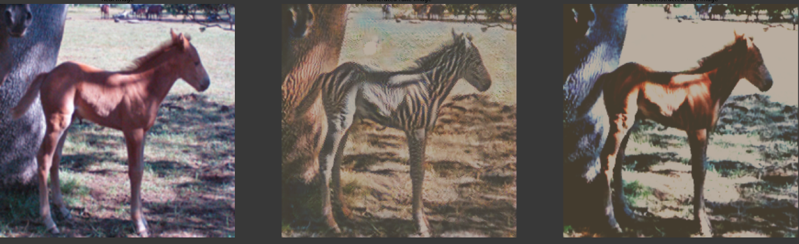
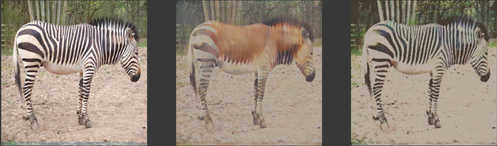

# Simple pytorch implementation of Cycle-GAN

* Project for learning
* Ideas mostly borrowed from: https://github.com/togheppi/CycleGAN
* Dataset: https://people.eecs.berkeley.edu/~taesung_park/CycleGAN/datasets/

* Result: 
> 1. Adam optimizer (Learning rate: 0.0002)
> 2. L1_loss and MSE_loss
> 3. Batch-size: 1. Epochs: 50

